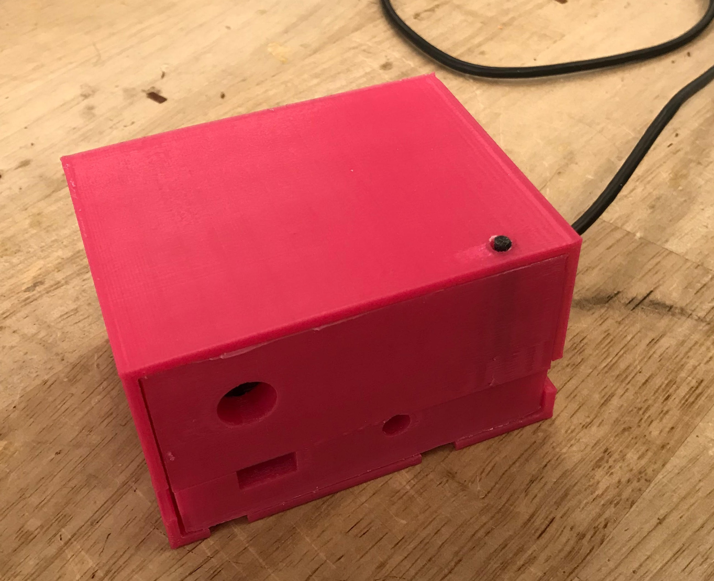
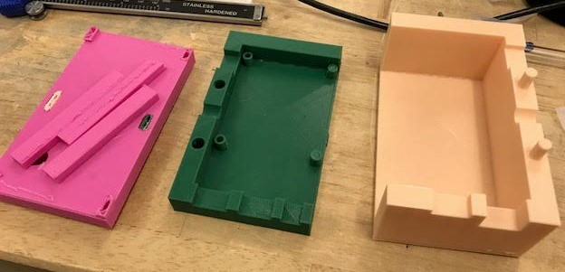
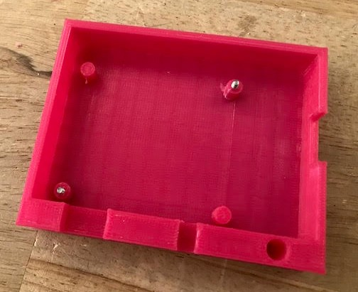
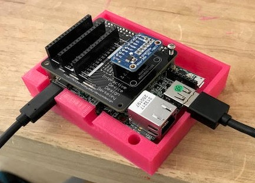
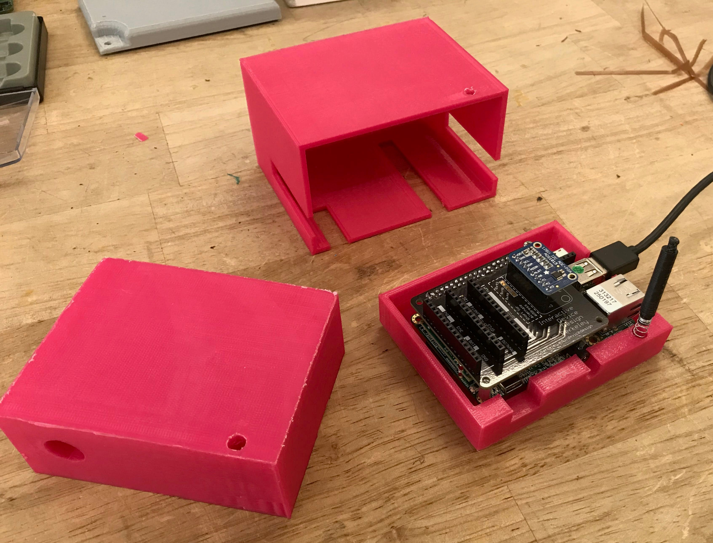
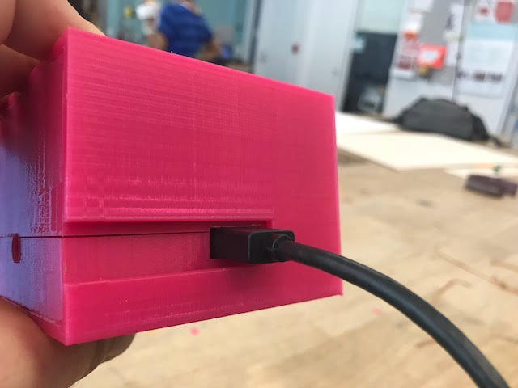

# Homework 4 - Steve and Linlin's Enclosure 

<b>Team Members:</b> 
Linlin Cai (the Expert) 
Steve Trush (the Noob)  

Using Fusion 360, we designed this elegant pink box to hold our PicoPro microcontroller and our IDD development HAT. The boards are screwed into the bottom of the box and openings allow for USB cables, speaker out, and various ribbon cables. The openings also allow for ventilation. An outer cover keeps the box closed (using a spring-loaded pushpin for quick access to the development board) without the need for a screwdriver, but secure enough so it doesn fall apart. The cover makes the enclosure more robust while also adding a sleek look.   

<b>Design Files:</b>
<a href="http://a360.co/2fSzQgX">Public Fusion360 Shared Link</a> 

There are 5 components: 
Enclosure Top 
Enclosure Bottom 
Enclosure Cover 
Pin 
PicoPro model 

<b>Process and strategy to model the different parts and to fit them together:</b>

We begun our design process by deciding what we wanted our enclosure to be able to accomodate. We decided to make our case without a display, but able to fit a HAT and breadboard cables. Additionally, we wanted to have a design where the box could be opened with using a screwdriver. We initially decided to try to design a top and bottom that could snap together. Here are our initial sketches:

We measured out the dimensions of the Pico Pro and constructed a 3D model of the board (with enough detail for incoming wire connections, and to accomodate the dev HAT and breadboard wires) in Fusion 360 to use the top-down design methodology. From there we constructed the outer shell of the enclosure making sure to cut wide enough holes for the connectors. We then dimensioned the outer cover to fit around inner box giving it a 1 mm extra space to make sure that the inner enclosure would fit after printing.

We then performed our first iteration of printing and learned that our snap fit design was not suitable for 3D printing using the PLA plastic. The interlocking snaps did not have the flexibility or durability to prevent breaking after multiple times opening the case.    
<b>Our failed first design. :( </b> 
 

Instead of trying to re-engineer the snapping pieces, we chose to redesign the box. This included sketching out a new system with a spring-loaded pin that would fit inside the wall of the top and bottom of the interior shell. When the cover was on, the smaller diameter tip of the pin would extrude through a catch to keep the box in place. Using the assembly function of Fusion360, we were able to join each our new pieces together to ensure that they fit.

Our successful second attempt.:) 
The bottom with screws for mounting the microcontroller. 
  
Yes! The holes line up and there's enough room for the cables! 
  
Everything else looks like it printed without errors.  
  
The pieces go together - this 3D modeling stuff actually works!  
 
...and the USB cable fits just fine! 
   

Does it pass the shake test? Yes! 

